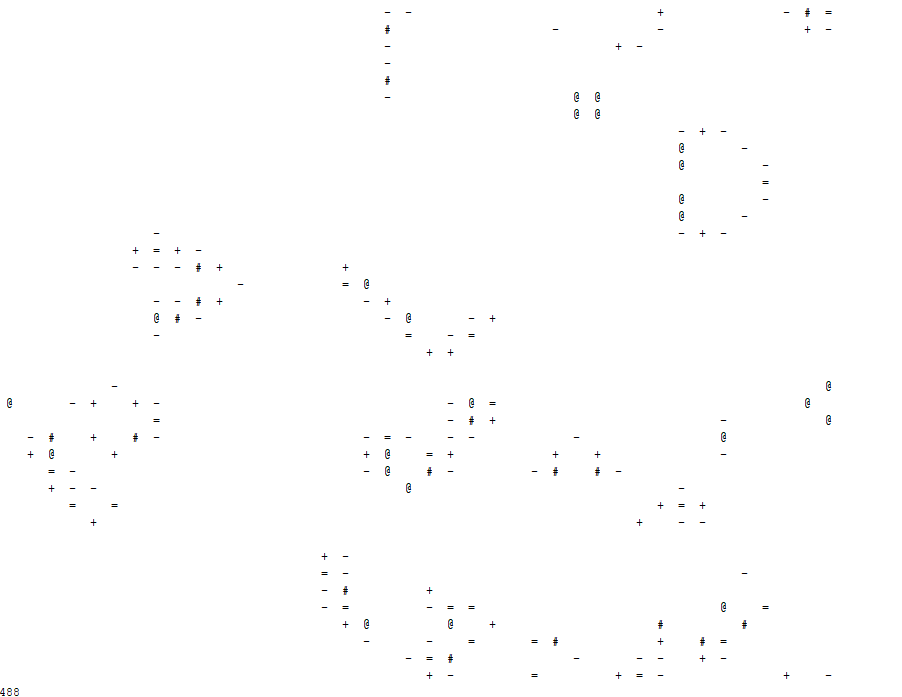

# Conway Generations

Simple game of life implementation in which each generation that the cell remains a live it intensifies.

See [Conway](https://github.com/ali-raheem/conway/) for a low footprint basic game of life library that does not track generation count.

Watch a run on [Youtube](https://youtu.be/VNp8FQVHZYA)

